# Схема базы данных — Digital Library

ER-диаграмма построена по `app/models/models.py` (SQLAlchemy ORM, PostgreSQL).
Просмотр: GitHub, VS Code (расширение Mermaid) или любой Mermaid-совместимый рендерер.

```mermaid
erDiagram
    users ||--o{ favourites        : "имеет"
    books ||--o{ favourites        : ""
    users ||--o{ reading_history   : "читал"
    books ||--o{ reading_history   : ""
    users ||--o{ reading_progress  : "прогресс"
    books ||--o{ reading_progress  : ""
    users ||--o{ search_history    : "искал"
    users ||--o{ book_ratings      : "оценил"
    books ||--o{ book_ratings      : ""
    books ||--o{ bookmarks         : "содержит"
    books ||--o{ notes             : "содержит"
    users ||--o{ friendships       : "user_id"
    users ||--o{ friendships       : "friend_id"
    users ||--o{ book_access       : "доступ"
    books ||--o{ book_access       : ""
    users ||--o{ group_members     : "состоит"
    groups ||--o{ group_members    : ""
    groups ||--o{ group_book_access : "открывает"
    books ||--o{ group_book_access : ""
    users ||--o{ user_achievements : "получил"

    users {
        int id PK
        string role "user | moderator | admin"
        string username UK
        string email UK
        string password_hash
        bool has_read_book_achievement
        string invite_token UK
    }

    books {
        int id PK
        bool is_visible_to_all
        string title
        float average_rating
        string author
        string language
        string genre
        string minio_key
        string cover_key
        float last_position
        string cfi
    }

    favourites {
        int id PK
        int user_id FK
        int book_id FK
    }

    bookmarks {
        int id PK
        string title
        int book_id FK
        float position
        string cfi
        int user_id "логич. → users (без FK)"
        bool is_shared
    }

    notes {
        int id PK
        string title
        int book_id FK
        float position
        string cfi
        text selected_text
        text comment
        int user_id "логич. → users (без FK)"
        bool is_shared
    }

    reading_history {
        int id PK
        int user_id FK
        int book_id FK
        datetime last_read_at
        float progress
    }

    reading_progress {
        int id PK
        int user_id FK
        int book_id FK
        string cfi
        float last_position
    }

    search_history {
        int id PK
        int user_id FK
        text query
        datetime created_at
    }

    friendships {
        int id PK
        int user_id FK
        int friend_id FK
        string status "pending | accepted"
        datetime created_at
    }

    book_ratings {
        int id PK
        int score
        int user_id FK
        int book_id FK
    }

    book_access {
        int id PK
        int book_id FK
        int user_id FK
    }

    groups {
        int id PK
        string name UK
        datetime created_at
        bool deny_download_data
        bool deny_import_data
        bool deny_friends
        bool allow_upload_files
        bool allow_manage_groups
        bool allow_manage_books_access
    }

    group_members {
        int id PK
        int group_id FK
        int user_id FK
    }

    group_book_access {
        int id PK
        int group_id FK
        int book_id FK
    }

    user_achievements {
        int id PK
        int user_id FK
        string code
        datetime created_at
    }
```

## Пояснения

- **PK** — первичный ключ, **FK** — внешний ключ, **UK** — уникальное поле.
- **Составные уникальные ограничения** (`UniqueConstraint`):
  - `book_ratings` — `(user_id, book_id)`: одна оценка пользователя на книгу.
  - `group_members` — `(group_id, user_id)`: один пользователь в группе один раз.
  - `group_book_access` — `(group_id, book_id)`: одна запись доступа группы к книге.
  - `user_achievements` — `(user_id, code)`: ачивка выдаётся один раз.
- **`bookmarks.user_id` и `notes.user_id`** объявлены как `Integer` **без** `ForeignKey` — связь с `users` логическая (на уровне приложения), а не ограничение БД. На диаграмме показаны для полноты.
- **Каскады**: связи `users`/`books` → дочерние таблицы помечены `cascade="all, delete-orphan"` в ORM; для `book_access`, групп и `user_achievements` дополнительно задан `ondelete="CASCADE"` на уровне БД.
- **Доступ к книге** определяется тремя путями: `books.is_visible_to_all`, прямой `book_access`, либо через группу (`group_members` → `group_book_access`).

## Группировка таблиц по доменам

| Домен | Таблицы |
|-------|---------|
| Пользователи и книги | `users`, `books` |
| Чтение | `reading_progress`, `reading_history`, `bookmarks`, `notes`, `favourites` |
| Социальное | `friendships` |
| Оценки и поиск | `book_ratings`, `search_history` |
| Геймификация | `user_achievements` |
| Доступ и управление | `book_access`, `groups`, `group_members`, `group_book_access` |
